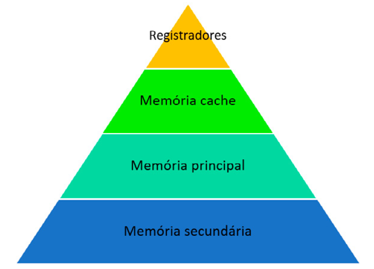

# Hierarquia da memória

Os computadores atuais tem utilizado a arquitetura de Von Neumann por anos. Nesta arquitetura temos uma Unidade Central de Processamento (CPU em inglês), uma memoria principal e sistemas de entrada/saída.

Memórias podem ser do tipo volátil ou não, de acesso sequencial ou randômico. Volátil significa que ao desligar a máquina, a memória perde toda a informação que esta registrada nela naquele instante. De acesso sequencial significa que para acessar um dado ou informação, o software deverá varrer célula após célula até encontrar o endereço* do dado desejado. Já a de acesso randômico significa que o endereço é setado de forma randômica porem não se tem certeza se o dado encontrado é o desejado.

A memoria principal é aquela onde podemos armazenar programas que estão em execução. Geralmente tem capacidade de alguns Gigabytes. Ela é volátil e de acesso randômico, por ser mais rápida que a memoria secundária, esta é util para armazenar programas que estão em execução. É ela a quem o processador procura quando necessita de informações que não estão próximas a ele nos registradores ou memória cache.

A memória secundária é aquela onde armazenamos programas permanentemente, isto é, ela é uma memória não volátil. Hoje em dia está na ordem do terabyte e é bastante lenta em relação ao processador.

Apesar da memoria principal ser rápida, não é o bastante para um processador que opera bilhões de instruções em apenas 1 segundo. Para que possamos aproveitar toda essa capacidade de processamento foi desenvolvido o conceito de memória cache e registradores. Registradores são os níveis mais baixos de memória em termos de capacidade, em torno de alguns bits, porém são os mais velozes. Já a memoria cache, consegue armazenar alguns Megabytes de informações o que é bastante relevante em termos de tempo de processamento.

Os principais atributos de memórias são o custo por bit armazenado, a velocidade de escrita e leitura, a capacidade de armazenamento e a volatilidade. Sendo os registradores os mais caros, mais rápidos, de menor capacidade e voláteis, e a memoria secundária a mais lenta, mais barata, de maior capacidade e não volátil.

# Memória [cache](https://www.youtube.com/watch?v=I8iGQjKGjDA&ab_channel=CódigoFonteTV) vs memória principal

A memória principal é o componente que auxilia na execução dos programas, porém, ela não é a mais rápida. Isto se dá pelo fato de que a memória principal é constituída fisicamente por capacitores, e estes tendem a [perder carga elétrica](https://www.newtoncbraga.com.br/index.php/duvidas-dos-internautas/2018-duv118.html#:~:text=O tempo que um capacitor,podem ocorrer de duas formas.) com o tempo. Sendo assim, a memória principal executa constantemente uma rotina denominada *Refresh*, a qual é responsável por "lembrar" cada célula da memória o seu valor.

Por executar essa rotina constantemente, perde-se tempo de processamento e, por sua vez, ocorre o evento denominado de gargalo de Von Neumann, isto é, o processador, mais rápido, tende a não sincronizar com a memória pois quando este solicita uma leitura e/ou escrita, a memória pode estar executando o modo *Refresh*. Por necessitar do *Refresh*, a memória principal é denominada de DRAM (Dynamic Random Access Memory). Todavia, para resolver o gargalo de Von Neumann foi desenvolvido a memória cache. A memória cache é constituída de circuitos transistorizados (flip-flops) os quais não necessitam do *Refresh* e, por sua vez, é chamada de SRAM (Static Random Access Memory). 

Entretanto, esses circuitos geram calor e por isso não permitem alta densidade de integração e por isso, a memória cache tem uma capacidade de armazenamento muito inferior a uma DRAM, mas os poucos Mebabytes de armazenamento são suficientes para armazenar informações importantes (endereços de memória) naquele instante por meio do **princípio da localidade**.

O princípio da localidade divide-se em duas vertentes, a espacial e a temporal. 

* Princípio da localidade espacial
  * se um endereço foi acessado, significa que os vizinhos provavelmente também serão
* Princípio da localidade temporal
  * se um endereço foi acessado, provavelmente ele será acessado em um curto espaço de tempo

Quando o processador consegue encontrar a informação desejada na memória cache, dizemos que houve um *Cache hit*. Quando não, dizemos que houve um *Cache miss* e, neste momento, ocorre uma rotina.

* O processador acessa a memória principal atrás da informação ou dado desejado
* Se a memória cache estiver cheia, escolhe qual bloco será substituído para dar lugar ao novo dado por meio de políticas de substituição, são elas
  * FIFO (First In First Out), primeiro a entrar primeiro a sair
  * LFU (Least Frequently Used), menos frequentemente usado, aquele com menos acesso
  * LRU (Least Recently Used), menos recentemente usado, aquele com mais tempo ocioso
* Em seguida o processador faz o endereçamento entre a memória cache a memória principal por meio do **mapeamento de cache**
  * Mapeamento direto
  * Mapeamento totalmente associativo
  * Mapeamento associativo por conjuntos

# Arquitetura e componentes de um processador

