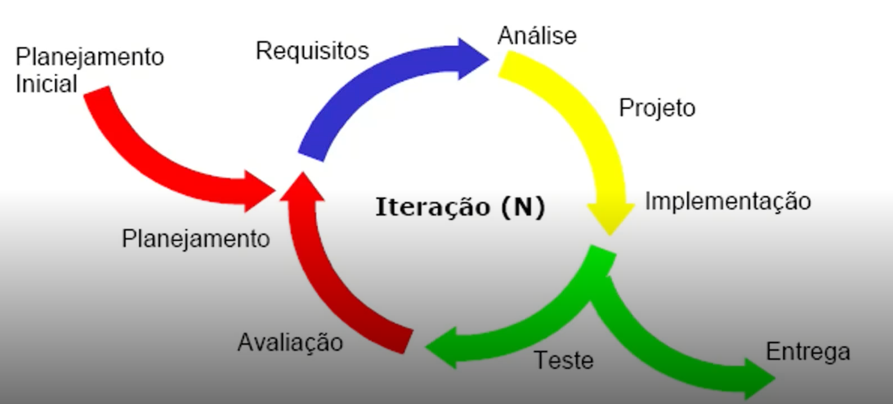
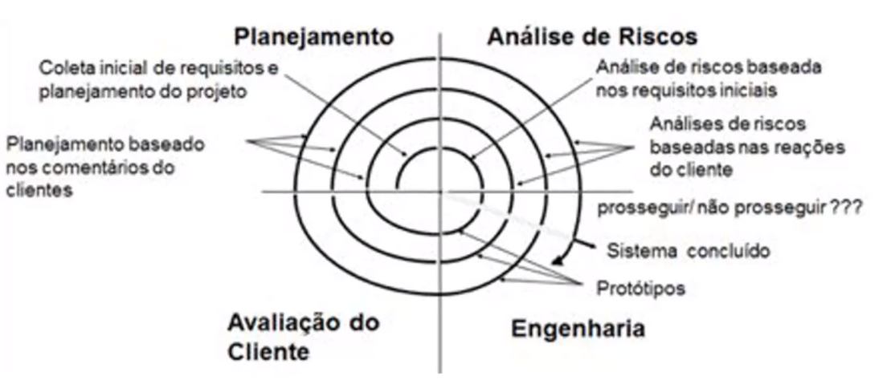
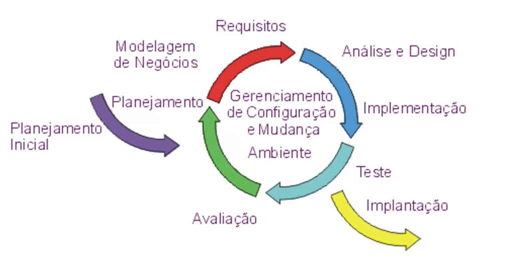

# Conceitos Básicos de Software

* softwares são programas de computador e documentação associada
* existem softwares genéricos e de sob encomenda
* Desenvolver software é complicado pois são abstratos e intangíveis
  * É difícil acertar custos e prazos
  * As vezes não atendem as necessidades do usuário
  * Em alguns casos são não confiáveis e de baixa qualidade
  * Um dos maiores problemas no desenvolvimento de software é a dificuldade de manutenção

* Por meio da engenharia de software foi possível
  * propor uso de processos, métodos e ferramentas que permitam o desenvolvimento de um produto com qualidade
  * a engenharia de software abrange todos os aspectos de produção, desde estágios iniciais até sua utilização e descarte
* Processos de engenharia de software envolvem
  * quem faz o quê e quando
  * passos gerais para se desenvolver ou manter sistemas de software
  * por meio de uma estrutura de encadeamento dos métodos
    * métodos descrevem como fazer um passo específico do processo
    * envolvem um amplo conjunto de atividades
  * Outro benefício que a engenharia de software trouxe foi as ferramentas
    * ferramentas da engenharia de software proporcionam apoio aos métodos
    * auxiliam e, às vezes, automatizam processos e métodos
    * podem ser ou não informatizadas
* O profissional engenheiro de software é responsável por
  * adotar uma abordagem sistemática e organizada para produzir software de alta qualidade
  * Um engenheiro de software pode executar papeis de
    * desenvolvimento
      * analista de sistemas
      * analista de requisitos
      * programador
      * analista de testes
      * administrador de dados
    * Suporte
      * Analista de Suporte
      * Analista de Redes
      * Analista de Infraestrutura
      * Administrador de banco de dados
* Principais causas da falha dos projetos de desenvolvimento de software são
  * Escolha errada da tecnologia a ser empregada no projeto
  * Escolha errada do processo de desenvolvimento do software
  * Mudanças rápidas nas regras de negócio
  * Pouco tempo de investimento no planejamento do projeto
  * Prazos irreais (subestimação ou superestimação do esforço)
  * Falta de recursos adequados
  * Falhas no processo de captura, especificação e gerência de requisitos

# Atividades do Processo de Software

* Conjunto de atividades e resultados associados que geram um software
* As principais atividades do processo de software são
  * **Especificação**
    * engenharia de requisitos
      * visa compreender e identificar os requisitos do sistema
      * Produz como principal artefato o documento de requisitos (muito utilizado para elaborar contratos)
      * a engenharia de requisitos é composta por algumas atividades
        * estudo de viabilidade
          * tenho tecnologia ?
          * isso que farei é legal?
          * quanto irá custar?
        * elicitação e análise de requisitos
          * modelagem do sistema por meio da UML
          * testar hipóteses quanto a prioridades e verificar conflitos
        * especificação de requisitos
          * detalhar e documentar os requisitos do usuário e do sistema
        * validação de requisitos
          * confrontar e acordar requisitos e a partir disso começar o desenvolvimento do software
  * **Desenvolvimento**
    * análise ou projeto
      * descreve-se a estrutura geral do software (arquitetura, interface, banco de dados)
    * implementação do software
      * codifica-se o sistema
      * produz como artefatos diagramas, códigos, leiautes de demais documentos necessários a construção do software
  * **Validação**
    * testes
  * **Evolução**
    * manutenção

# Ciclo de vida do software

* Um ciclo de vida define um encadeamento específico das atividades do desenvolvimento de software

* É aplicado para conduzir o desenvolvimento e vai produzir artefatos na finalização de cada atividade

* Os principais ciclos de vida de software são

  * **Cascata**

    * atividades realizadas em sequência
    * inicia-se e conclui uma atividade antes de passar para outra
    * adequado quando se tem requisitos estáveis, bem definidos e compreendidos
    * tem como vantagens
      * a abordagem sistemática e sequencial do desenvolvimento de software
      * as atividades são vistas como estágios do processo
      * serve de base para outros modelos
    * tem como desvantagens
      * é difícil estabelecer de forma explícita todos requisitos do sistema
      * cliente deve espera por uma versão do produto
      * risco de insucesso é alto

  * **Incremental**

    * baseado na ideia de desenvolver uma versão inicial e continuar criando novas versões
    * entrega uma série de versões chamadas de incrementos
    * divisão em várias cascatas
    * tem como vantagens
      * cada incremento entregue é usado pelo cliente
      * mudanças ou novos requisitos serão considerados para os próximos incrementos
      * risco de falha geral do projeto é menor
    * tem como desvantagens
      * estrutura do sistema tende a se degradar com a adição de novos incrementos
      * dificuldade em identificar os recursos que serão compartilhados pelos incrementos
      * inadequado para os casos onde se quer substituir um sistema em operação

  * **Iterativo**

    * também conhecido como evolucionário

    * software é desenvolvido por uma série de iterações evolucionárias ou ciclos

    * cada ciclo representa uma fase do processo

    * representado pelos modelos de prototipação e em espiral

    * representado por

      

    * tem como vantagens

      * possibilidade de melhorar o sistema em cada iteração
      * reduz os riscos arquiteturais

    * tem como desvantagens

      * requer experiência com a avaliação de riscos
      * orçamento do desenvolvimento não pode ser fixo

  * **Ágil**

    * Utiliza os modelos iterativos e incrementais
    * maior colaboração com o cliente
    * maior integração entre as equipes de desenvolvimento
    * tem como vantagens
      * cliente vê os resultados mais rapidamente
      * entregas frequentes do produto funcional
      * agilidade em responder as mudanças
    * tem como desvantagens
      * equipes se dispersam com facilidade devido à falta de processos
      * entregas frequentes podem prejudicar projetos de longo prazo
      * dificuldade para manter uma colaboração constante entre equipes

# Modelos iterativos

* software é desenvolvido por uma série de iterações evolucionárias ou ciclos
* cada ciclo representa uma fase do processo
* representado pelos modelos de prototipação e em espiral

## Modelo de prototipação

* construir um software a partir de um protótipo
* ideal para quando os requisitos são obscuros
* pode ser utilizado como um modelo isolado
* mas também como uma técnica passível de ser implementada por outro modelo de processo
* composto pelas fases de
  * plano rápido
  * modelagem de projeto rápido
    * de que maneira iremos construir o protótipo?
  * construção do protótipo
  * implantação, entrega e feedback
  * comunicação
* um protótipo é uma versão inicial de um sistema
  * útil para demonstrar conceitos
  * testar opções de projeto
  * podendo ser utilizado na elicitação e validação de requisitos
* para desenvolver um protótipo devemos
  * estabelecer objetivos do protótipo
    * plano de prototipação
  * definir funcionalidade do protótipo
    * definição geral
  * desenvolver protótipo
    * protótipo executável
  * avaliar o protótipo
    * relatório de avaliação
* a prototipação traz uma série de vantagens
  * permite desenhar as interfaces do usuário
  * explica as funcionalidades complexas do sistema
  * auxilia no entendimento de requisitos confusos
* tem como desvantagens
  * o cliente acha que o software está pronto
  * não tem reaproveitamento do que foi descartado
  * estoura os prazos da construção de protótipos
  * risco de concentrar mais na aparência visual do que nas funcionalidades

## Modelo em espiral

* também chamado de modelo de Boehm
* combina a natureza iterativa da prototipação com a sistemática do modelo cascata
* software é desenvolvido por uma série de iterações evolucionárias ou ciclos
* cada ciclo representa uma fase do processo

* tem como vantagens
  * possibilidade de melhorar o sistema a cada iteração
  * reduz os riscos antes de se tornarem problemáticos
* tem como desvantagens
  * dificuldade de convencer o cliente de que é controlável
  * requer experiência com a avaliação de riscos
  * o orçamento do desenvolvimento não pode ser fixo

# Modelo de processo unificado

* É um processo de desenvolvimento de software definido para apoiar a utilização da UML
  * Universal Modeling Language
* As principais características do processo unificado são
  * mescla entre modelos iterativo e incremental
  * é um modelo dirigido por caso de uso
    * permite representa as funcionalidades do sistema
  * centrado na arquitetura
    * foco nas principais funcionalidades do sistema
    * aquelas que podem impactar, por exemplo, a
      * segurança
      * desempenho
      * usabilidade do sistema
  * centrado em componentes
  * caracterizado pela avaliação de riscos

## Perspectivas do processo unificado

* Perspectiva dinâmica (fases)
  * representa a dimensão de tempo
  * mostra o progresso de um projeto através do tempo, descrevendo fases, marcos e iterações
  * as fases são
    * iniciação (concepção)
      * termina quando se tem os objetivos do ciclo de vida
      * requisitos do sistema
    * elaboração
      * detalhar mais os objetivos afim de obter a arquitetura do ciclo de vida
    * construção
      * termina com um software capaz de realizar operações iniciais
    * transição
      * termina com o lançamento do produto
* Perspectiva estática (atividades)
  * representa a dimensão de conteúdo
  * descreve as atividades que precisam ser realizadas no desenvolvimento do software
  * na perspectiva estática temos as disciplinas
    * requisitos
    * análise e projeto
    * implementação
    * teste
    * implantação
* Perspectiva prática
  * descreve as boas práticas de engenharia de software a serem usadas no processo
  * são elas
    * desenvolver o software iterativamente
    * gerenciar requisitos (mudanças de projeto)
    * usar arquiteturas baseadas em componentes
      * adequar componentes para que aceitem mudanças
    * modelar o software visualmente (UML)
    * verificar a qualidade do software
    * controlar as mudanças do software

## Vantagens e desvantagens do processo unificado

* Tem como vantagens
  * antecipar mudanças, devido às entregas parciais
  * controlar os riscos do projeto
  * foca o desenvolvimento no produto do cliente
  * aumenta a qualidade do produto final
* Tem como desvantagens
  * um processo pesado (muitas atividades e muitos artefatos)
  * aplicado de preferência em grandes projetos com grandes equipes
  * não é adequado a todos os tipos de sistema (sistemas embarcados, por exemplo)
  * exige sinergia entre os que usam e os que desenvolvem
    * problemas com comunicação oferecem riscos ao sucesso do projeto

## Modelos derivados do processo unificado

* Rational Unified Process (RUP)
  * Processo proprietário (pago) da IBM Rational
  * Incorporou mais 4 disciplinas
    * modelagem de negócio
    * gerenciamento de projetos
    * gerenciamento de configuração e mudanças
    * ambiente
  * 
* OpenUP
  * uma versão ágil do processo unificado
  * eliminou algumas práticas operacionais e também alguns artefatos
  * entrega menores (micro incremento, dias)
  * ciclo de vida de iteração (semanas)
  * ciclo de vida de projeto (meses)
